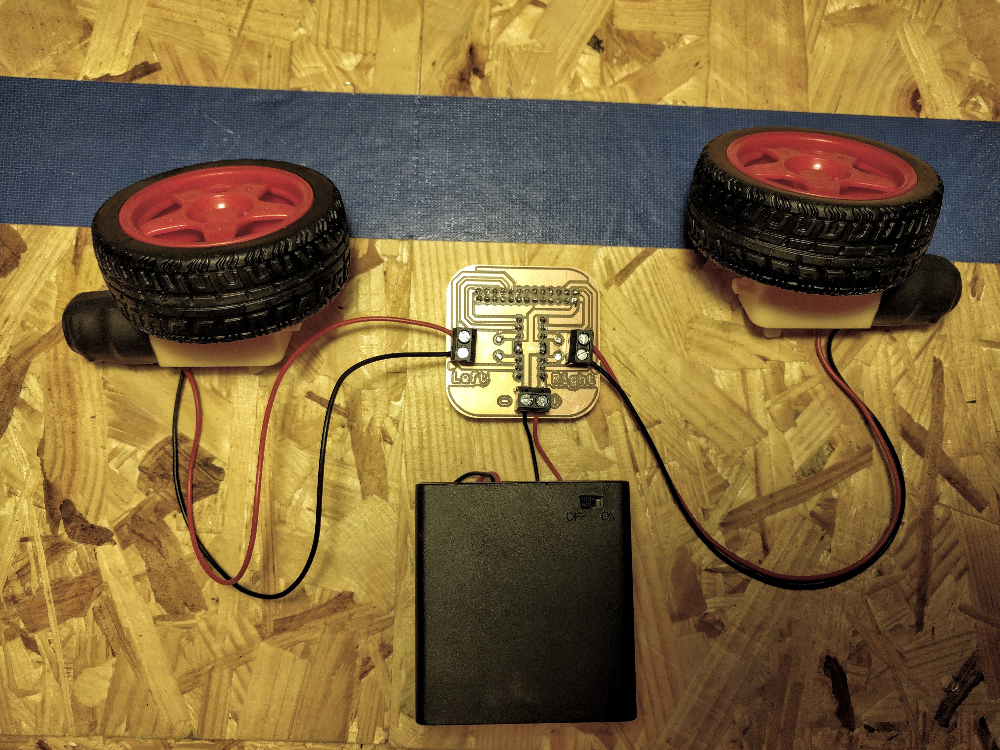

# pi-robo-baord

H-Bridge controller for powering two motors from any Raspberry Pi.

## Hardware

### Connecting

#### 1. Connect the battery pack (5-9V) to the lower screw terminal. Mind the polarity (black left, red right).

#### 2. Connect the motors

### Components

- 1x Circuit Board
- 1x SN754410NE Dual H-Bridge (DIP-16 enclosure)
- 1x 16-pin DIP IC socket
- 3x Two-pin screw header (5mm pitch)
- 1x 26-pin (2-row) female connector for connection with the RPi

### Milling the Board

The current board design can be milled directly from the included gerber files using a *1/32" flat end mill* and an *80° engraving bit*.

It was tested on an **Othermill** using two-sided copper base material.

### Assembly

TBD
