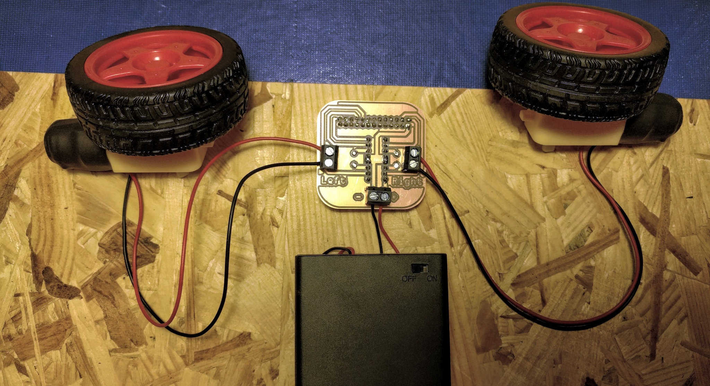
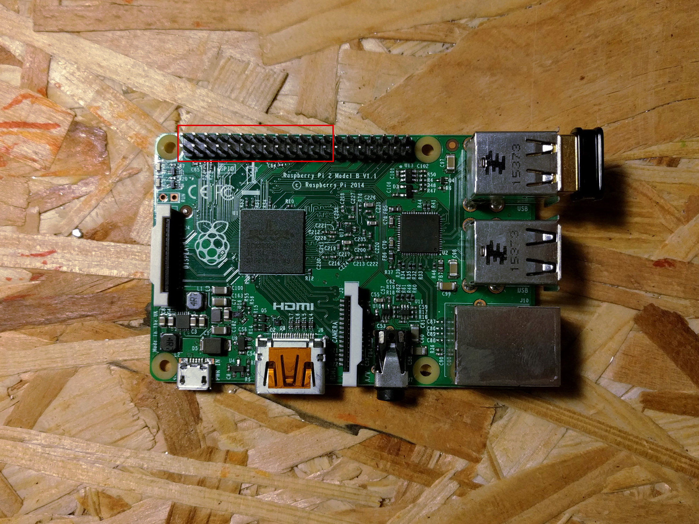
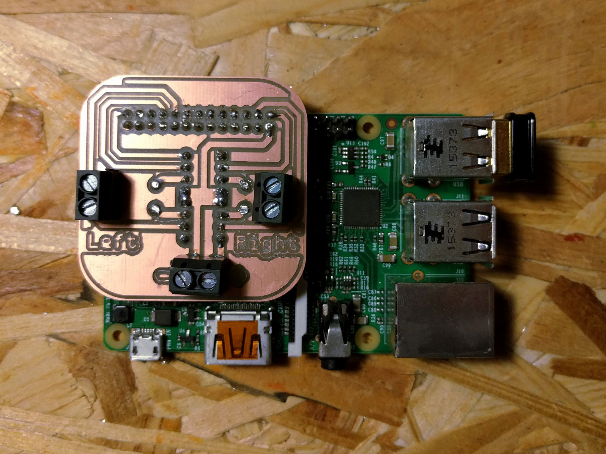

# erfinder robot-hat

H-Bridge controller for powering two motors from any Raspberry Pi.

## Connecting


1. Connect the battery pack (5-9V) to the lower screw terminal. **Mind the polarity** (black left, red right)
2. Connect the motors (Polarity is minor; reverse polarity if motor rotates in the wrong direction)
3. Plug the board into your Raspberry Pi. Make sure to use the correct pins on your pi and mind the orientation, according to the following images:




---

## Software
A `Erfinderbot` class is included controlling the robot using Python. It extends the `Robot` class from the [gpiozero library](https://github.com/RPi-Distro/python-gpiozero).

### Instructions
1. Copy `Erfinderbot.py` into your project directory
2. Install gpiozero using the following command `pip install gpiozero`
3. Then you can create a new `Erfinderbot` instance using the following code:

```python
from Erfinderbot import Erfinderbot

my_robot = Erfinderbot()
# Now you can use my_robot just like a
# regular gpiozero.Robot, for example:
my_robot.forward()
# time.sleep(1)
my_robot.stop()
```

For more usage examples, please refer to the official [gpiozero documentation](https://gpiozero.readthedocs.io/).

### Without gpiozero
The left motor is connected to pins BCM 15 and 14, the right one is connected to 7 and 8.

---

## Building

Refer to the [manufacturing manual](docs/manufacturing.md) for instructions on how to fabricate the board on your own.

